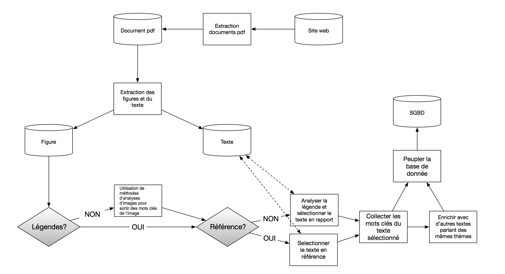

# Projet Tableau De Bord
Projet M1 SID Tableau de bord (Amira Ayadi, Antoine Plissonneau)

###Outils utilisés

* Github: Pour travailler sur exactement les mêmes fichiers 
* Python:
 * __requests, urlib__ : gère les différentes requêtes http, utilisé pour acceder aux differentes pages web (résultats recherche et pdf)
 * **PDFminer**: parser de pdf 
 * __BeautifulSoup__: parser de page web
 * __json__: permets de créer des fichiers JSON
* Pile ELK?:
 * __Logstash__
 * __ElasticSearch__
 * __Kibana__
* MongoDB?
* SQLServer?

###Ressources utilisées

* IOPScience
* Web Of Science

###Schéma

